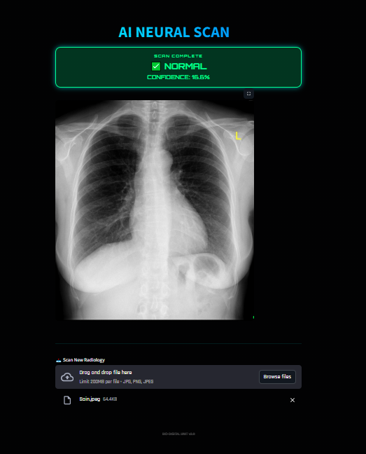
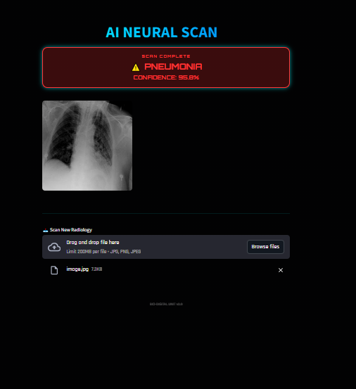

# 🫁 Pneumonia AI Neural Scan

> **Système expert de diagnostic par IA pour radiographies thoraciques.**



---

## 📝 À propos du projet

Cette application utilise un modèle de **Deep Learning** (MobileNetV2) pour analyser des radiographies pulmonaires. Elle est capable de distinguer des poumons sains d'une infection par pneumonie avec un haut degré de confiance.

### Points forts :

* **Interface Cyber-Médicale** : Design sombre et futuriste optimisé pour le mobile.
* **Résultats instantanés** : Analyse et diagnostic en un clic.
* **Ergonomie** : Affichage prioritaire du résultat et de l'image en haut de l'écran.

---

## 💻 Installation locale

### 1. Installation des dépendances

Ouvrez votre terminal et exécutez la commande suivante :

```bash
pip install streamlit tensorflow pillow numpy

```

### 2. Lancement de l'application

Placez-vous dans le dossier du projet et lancez Streamlit :

```bash
streamlit run main.py

```

---

## 📁 Structure requise

Pour que l'application fonctionne, respectez cette organisation :

* `main.py` (le code de l'app)
* `model/`
* `pneumonia_classifier.h5`
* `labels.txt`


* `screenshot.png` (votre capture d'écran)

---

*Note : Ce projet est une démonstration technologique à but éducatif.*

